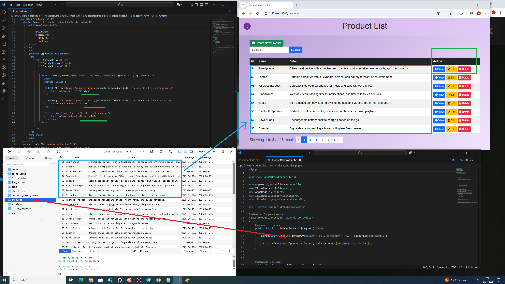

## 📸 Screenshots
<h2>MVC product CRUD with error handler, search and pagination.</h2>
<h3>1. Products</h3>

<h3>2. View page of product</h3>

<h3>3. a) Before create product</h3>

<h3>3. b) After create product</h3>

<h3>4. a) Before edit product</h3>

<h3>4. b) After edit product</h3>

<h3>5. a) Before delete product</h3>

<h3>5. b) After delete product</h3>

<h3>6. Error handler</h3>

<h3>7. Search</h3>

<h3>8. Pagination</h3>

